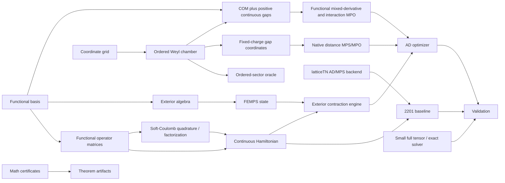

# Architecture

## Module boundaries

- `femps.basis`: continuous orthonormal bases and their operator matrices.
- `femps.baselines`: reproducible non-fermionic functional-TN baselines.
- `femps.exterior`: wedge/forms/reference materialization and the conditionally
  admitted fixed-number Pfaffian contraction engine.
- `femps.ordered_sector`: exact normalized chamber maps and local coordinate-grid
  hard-wall oracles for small-system representation comparisons.
- `femps.ordered_distance`: the exact ordered-grid/gap bijection and independent
  small fixed-charge Hamiltonian truth matrices.
- `femps.baselines.ordered_distance_mpo`: polynomial-bond kinetic, trap,
  finite-box, and interval-interaction MPOs plus the native latticeTN MPS bridge.
- `femps.ordered_continuous`: the exact unit-Jacobian center-of-mass/positive-gap
  transform, kinetic and harmonic metrics, and ordered-chamber normalization.
- `femps.basis.dirichlet_sine` and `femps.basis.odd_hermite`: finite-interval and
  unbounded collision-Dirichlet distance bases with projected local operators.
- `femps.baselines.ordered_continuous_mpo` and
  `femps.baselines.ordered_continuous_interaction`: native functional MPOs for
  the mixed continuum Hamiltonian and controlled interval-polynomial
  soft-Coulomb interaction.
- `femps.baselines.ordered_continuous_fourier`: unbounded Fourier--Bessel
  soft-Coulomb quadrature, projected cosine/sine operators, and a compact
  four-state all-pair recurrence with interaction bond `4M`.
- `femps.hamiltonians.soft_coulomb`: Gauss--Hermite two-body integrals,
  symmetric kernel factorization, and an independent `N=2` relative-grid oracle.
- `femps.states`: Slater, explicit antisymmetric, and FEMPS states.
- `femps.algorithms`: contractions and optimization admitted after exact tests.
- `femps.benchmarks`: normalized records, direct-truth feasibility budgets, and
  error-axis closure for controlled comparisons.
- `math/`: proof and certificate pipelines, isolated from production solvers.

`latticeTN` stays an upstream sibling dependency. FEMPS reuses its PyTorch MPS,
native contractions, device/dtype conventions, and AD infrastructure instead
of copying them.

The ordered-distance production path carries the finite box as an exact MPS
charge: the sum of `N+1` nonnegative gaps is `L-N`. Dense gap tensors and exact
diagonalization are confined to small truth audits. The finite-grid module
remains a structural oracle. Gate D admits the continuous COM/half-line
functional-basis layer for controlled small systems. Gate E adds the
interacting unbounded odd-Hermite path through controlled N=6 and globally
audited Fourier-MPO compression. The current builder still materializes dense
raw `W^2 D^2` MPO blocks before compression; removing that temporary cost and
improving basis efficiency are active work.

The finite-AGP optimizer accepts either the configured harmonic/soft-Coulomb
operators or an explicitly identified external one-/two-body functional
operator pair. Checkpoints store the operator identifier and reject a mismatched
resume. This keeps the AD/exterior solver independent of the chosen functional
basis while preserving reproducibility.
