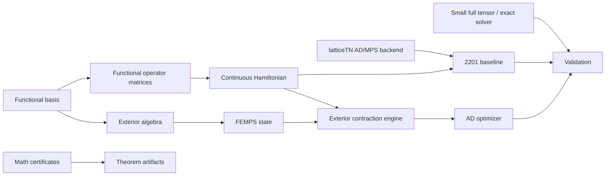

# Architecture

## Module boundaries

- `femps.basis`: continuous orthonormal bases and their operator matrices.
- `femps.baselines`: reproducible non-fermionic functional-TN baselines.
- `femps.exterior`: wedge/forms/reference materialization and the conditionally
  admitted fixed-number Pfaffian contraction engine.
- `femps.states`: Slater, explicit antisymmetric, and FEMPS states.
- `femps.algorithms`: contractions and optimization admitted after exact tests.
- `math/`: proof and certificate pipelines, isolated from production solvers.

`latticeTN` stays an upstream sibling dependency. FEMPS reuses its PyTorch MPS,
native contractions, device/dtype conventions, and AD infrastructure instead
of copying them.
