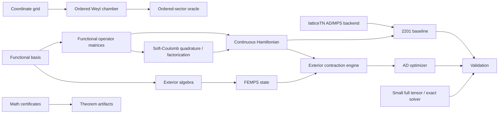

# Architecture

## Module boundaries

- `femps.basis`: continuous orthonormal bases and their operator matrices.
- `femps.baselines`: reproducible non-fermionic functional-TN baselines.
- `femps.exterior`: wedge/forms/reference materialization and the conditionally
  admitted fixed-number Pfaffian contraction engine.
- `femps.ordered_sector`: exact normalized chamber maps and local coordinate-grid
  hard-wall oracles for small-system representation comparisons.
- `femps.hamiltonians.soft_coulomb`: Gauss--Hermite two-body integrals,
  symmetric kernel factorization, and an independent `N=2` relative-grid oracle.
- `femps.states`: Slater, explicit antisymmetric, and FEMPS states.
- `femps.algorithms`: contractions and optimization admitted after exact tests.
- `femps.benchmarks`: normalized records, direct-truth feasibility budgets, and
  error-axis closure for controlled comparisons.
- `math/`: proof and certificate pipelines, isolated from production solvers.

`latticeTN` stays an upstream sibling dependency. FEMPS reuses its PyTorch MPS,
native contractions, device/dtype conventions, and AD infrastructure instead
of copying them.

The finite-AGP optimizer accepts either the configured harmonic/soft-Coulomb
operators or an explicitly identified external one-/two-body functional
operator pair. Checkpoints store the operator identifier and reject a mismatched
resume. This keeps the AD/exterior solver independent of the chosen functional
basis while preserving reproducibility.
