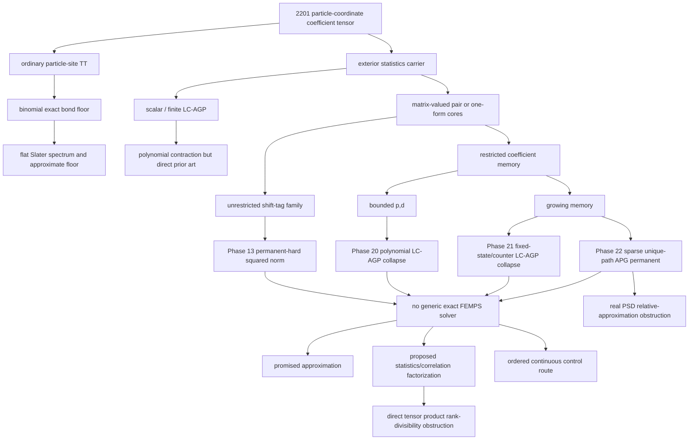

# FEMPS representation and contraction no-go hierarchy

## Evidence status

This document began as the Phase 23 synthesis draft. It separates proved elementary
linear/exterior identities, theorem drafts awaiting external review, bounded
exact certificates, numerical tests, and complexity consequences based on
published permanent results. Phase 24 additionally classifies one relative-
approximation corridor. It is not a universal impossibility theorem for
fermionic tensor networks or for every structured/approximate FEMPS.

Throughout, “squared norm” means the unnormalized inner product
`<Psi|Psi>`. Some older project files use “norm contraction” for this same
quantity. Exact complexity statements concern rational/integer arithmetic.
The separate approximation statement below uses a real-PSD permanent theorem
and must not be inferred from exact #P-hardness alone.

## Two logically independent obstructions

The project has two different no-go axes:

1. **Representation axis.** Storing a fully alternating coefficient tensor as
   an ordinary particle-site TT charges the virtual bond for exchange
   statistics. Even one Slater determinant has a binomial, flat particle-cut
   spectrum.
2. **Contraction axis.** Moving antisymmetry into an exterior carrier removes
   that ordinary-TT bond floor, but a compact exterior parameterization need
   not have a polynomial exact squared-norm or Hamiltonian contraction.

Neither axis implies the other. A single Slater has exponential middle
particle-TT rank yet contracts by a determinant. Conversely, the Phase 22 hard
instance ends in a one-dimensional top exterior sector, but evaluating its one
scalar coefficient from compact geminal data is a permanent.



## Theorem hierarchy

### R1. Ordinary particle-TT rank identity and exchange floor

For `0 != C in Lambda^N V`, the minimal ordinary TT bond at the `k|N-k`
particle cut equals the rank of that matricization and obeys

```text
r_k >= binom(N,k).
```

The proof selects a nonzero alternating coefficient and exhibits a signed
diagonal `binom(N,k)` minor. Therefore any nonzero TT below this floor cannot
remain fully alternating. These are exact real/complex linear-algebra
statements, not complexity assumptions.

### R2. Slater approximate floor

For orthonormal orbitals, a normalized Slater determinant has exactly
`binom(N,k)` equal particle-Schmidt values. Hence every cut-rank-`r`
approximation has relative squared error at least

```text
max(0, 1-r/binom(N,k)).
```

This is sharp for the Slater state and does not assert flat spectra for general
alternating tensors. It rules out ordinary particle-TT truncation as a way to
remove the exchange floor while preserving high fidelity to even the simplest
fermionic state.

### C1. Unrestricted exact matrix-wedge contraction obstruction

For even `N=2n`, Phase 13 maps a row-ordered Cayley determinant over
`Mat_2(Q)` into one top-degree matrix-pair amplitude with `D=N`, pair bond
`2(n+1)`, and then into one-form matrix-wedge FEMPS with maximum bond `O(N^2)`.
Shift matrices annihilate every factor order except row order. A virtual direct
sum and two exact squared-norm queries recover each signed hard amplitude.

Chien--Harsha--Sinclair--Srinivasan prove that the source determinant is as hard
as the permanent [@ChienHarshaSinclairSrinivasan2011NoncommDet]. Therefore a
generic exact contraction polynomial jointly in `(N,D,chi)` would imply
`FP=#P`. This is a polynomial-time Turing reduction over exact rational input.
It remains useful because it isolates growing noncommutative order memory.

### C2. Uniformly bounded coefficient algebras collapse to LC-AGP

Let a finite-dimensional complex coefficient algebra have largest semisimple
matrix block `p` and radical nilpotency index `d`. If `(p,d)` are constants,
then every arbitrary-boundary pair power has an explicit polynomial-size exact
LC-AGP expansion. A theorem-draft bound is

```text
K <= sum_(k=0)^min(d-1,M)
       q^(k+1) rho^k binom(M+(k+1)p^2+k-1,(k+1)p^2+k-1),
```

where `q` is the number of simple blocks and `rho` is the radical dimension.
The proof uses the Wedderburn--Malcev splitting, the fact that `d` radical
insertions vanish, and characteristic-zero homogeneous-power spanning. Exact
`T_2` and `Mat_2` base-case certificates support the construction.

This result corrects an unsafe analogy with noncommutative determinants: a
fixed `Mat_2` pair power needs at most `binom(M+3,3)` AGPs even though the row-
ordered determinant over `Mat_2` is hard. Fixed noncommutativity is not the
hard resource; the Phase 13 reduction requires growing order memory.

### C3. Selected growing memories still collapse

For `C[z]/z^d`, arbitrary boundaries require at most `M(d-1)+1` AGPs, jointly
polynomial even when `d` grows. More generally, a faithful representation in
fixed-width `Mat_w` over a fixed number `g` of truncated commuting counters
gives

```text
K <= product_j [M(d_j-1)+1]
     binom(M+w^2-1,w^2-1).
```

This includes a genuinely noncommutative alternating-word algebra with radical
depth `d`. Its two-state path memory remains an LC-AGP reorganization. The
results are exact characteristic-zero coefficient-interpolation identities,
with every boundary certified in the selected small cases.

### C4. Sparse growing width can already be hard

An `(M+1) x (M+1)` upper-bidiagonal pair-form matrix with endpoint boundaries
has one virtual path and state `F_1 wedge ... wedge F_M/M!`, exactly APG. For
paired orthonormal forms `P_j` and `F_i=sum_j A_(i,j)P_j`,

```text
Psi = perm(A) P_1...P_M/M!,
<Psi|Psi> = perm(A)^2/(M!)^2.
```

For 0--1 `A`, one exact squared-norm query and an exact nonnegative square root
recover a #P-complete permanent [@Valiant1979Permanent]. The instance has
`D=2M`, width `M+1`, bandwidth one, one path, and `O(M^2)` binary input.
Tridiagonal/fixed-bandwidth classes that contain this specialization therefore
have no generic joint-polynomial exact contraction unless `FP=#P`.

This theorem does not imply high LC-AGP rank: the hard output top sector is
one-dimensional. It is a compact-input coefficient-evaluation obstruction.
Because the matrix-pair state embeds with polynomial bond into the original
one-form matrix-wedge ansatz, C4 by itself is also a simpler proof of the C1
generic consequence. C1 retains an independent mechanism and certificate, not
a logically necessary dependency of the main no-go.

### C5. Generic relative approximation remains obstructed

The C4 formula holds for arbitrary real coefficient arrays, so choose `A` to
be real positive semidefinite. If a randomized polynomial scheme returned
`n_tilde` with relative error `epsilon` for every sparse-path squared norm,
then

```text
M! sqrt(n_tilde)
```

would approximate the nonnegative `perm(A)` between factors
`sqrt(1-epsilon)` and `sqrt(1+epsilon)`. This would be a PRAS for real-PSD
permanents. Meiburg proves that no such PRAS exists unless `RP=NP`, including
for purely real PSD inputs [@Meiburg2023PSDPermanent]. Thus a generic relative
squared-norm approximation scheme would imply `RP=NP`.

This does not contradict the Jerrum--Sinclair--Vigoda FPRAS for **entrywise
nonnegative** matrices [@JerrumSinclairVigoda2004PermanentFPRAS]. PSD and
entrywise nonnegative are different promises. Nor does it reject Gurvits-type
polynomial additive estimators for arbitrary complex matrices
[@AaronsonHance2014Gurvits]. Additive error controls a Rayleigh quotient only
under a denominator certificate `n_tilde>Delta_n`; cancelling inputs can make
the true exterior norm exponentially small in input precision.

### C6. The direct statistics-carrier tensor product is not universal

Let `B_k(C)` be the image of the exterior contraction map at the particle cut.
If

```text
B_k(C) ~= S_(N,k)^fermion tensor M_k(C)
```

were exact for every state and a Slater had `dim M_k=1`, then at `k=1` the
fixed carrier would have dimension `N` and every cut rank would be divisible by
`N`. For every `N>=3`, however,

```text
C_N = e_1 wedge (e_2 wedge e_3 + e_4 wedge e_5)
      wedge e_6 wedge ... wedge e_(N+2)
```

has `r_1=N+2`. Its `N+2` one-index contractions are independent, and the full
rank persists under orbital changes, direct embeddings, and generic small
perturbations. Thus the literal tensor product is impossible.

Standard symmetry adaptation does not repair the proposal. The `S_N` sign
representation is one-dimensional; under `GL(V)`, `Lambda^N V` is irreducible
and occurs with Littlewood--Richardson multiplicity one in the exterior cut,
leaving the full orbital irrep rather than a free correlation degeneracy.
State-adaptive Slater/secant channels are established determinant expansions,
not a canonical tensor factor. Finally, the C4 output is projectively one
Slater but its scalar is a permanent, so intrinsic multiplicity one does not
compile compact cores into a norm algorithm.

## Claim-to-evidence map

| ID | Field and scope | Proof artifact | Independent exact evidence | External dependency |
|---|---|---|---|---|
| R1--R2 | real/complex, `D>=N`, ordinary particle TT | `math/no_go_theorems.tex`; `docs/theory/no_go.md` | Slater materialization/rank/spectrum tests | standard TT rank and Eckart--Young theory |
| C1 | rational, even `N`, unrestricted matrix-wedge | `math/generic_femps_contraction_obstruction.tex` | tagged Cayley orders 1--4, hash `893077be401414cd810fa1154e618d37d83b58e077732801f2482b3716b2c0c0` | Chien et al. `Mat_2` Cayley-determinant hardness |
| C2 | complex characteristic zero, fixed `(p,d)` | `bounded_radical_pair_collapse.md` | `T_2` M=1--6 hash `f671c2c10376c39cfb8c223edafba370570b9c417e8b12bcaaeb2f0f66cf078c`; `Mat_2` M=1--4 hash `74d2de4a2cedcbaf548cd4c9895d0ea4af48e6bb485b72966562e46277a6d20d` | Wedderburn--Malcev and polarization |
| C3 | complex characteristic zero, fixed `(w,g)` graded representation | growing/fixed-state collapse notes | all `C[z]/z^d` boundaries hash `07a222de3f44ced1b3fe155638299fdb8443a54f3d9f36479b994f32f9f0fd55`; alternating words hash `082238ff6e6783b7533b3b2a59f3664beb1820794bcae573add98baf43370030` | Vandermonde interpolation; Waring/automata prior art |
| C4 | nonnegative integer/rational, even `N` | `sparse_path_apg_obstruction.md` | three routes, M=1--6, hash `dd72c1aaeb0bc2a6b9206992cde9099f2f568b7ff6c8ed8eb7e38d958f78e790` | Valiant 0--1 permanent #P-completeness; APG prior art |
| C5 | real PSD rational input; randomized relative squared norm | `approximate_exterior_contraction_gate.md` | exact positive/cancelling/conditioned/PSD and energy controls, hash `c15e7ff268a962e2790004c7f63d47bedb53be0c887ab0241e671b7fe4ff3b16` | Meiburg PSD-permanent inapproximability; JSV and Gurvits positive boundaries |
| C6 | real/complex, `N>=3`, direct carrier tensor product | `statistics_carrier_multiplicity_obstruction.md`; `math/statistics_carrier_obstruction.tex` | exact all-cut, orbital-permutation, embedding, and perturbation ranks for N=3--8, hash `06025f168a49c0ab857c2163103ffabcb56fb04cd1fed4df9120d25ef6bc60df` | symmetry-adapted TN and Grassmannian-secant prior art; standard sign/Littlewood--Richardson facts |

## Coverage boundary

The hierarchy establishes neither of the following universal statements:

- every exterior/FEMPS family is hard;
- every exactly tractable exterior family is polynomial LC-AGP/Gaussian.

It classifies the tested design corridor. Specifically, it does not cover:

- additive approximation with a certified polynomial norm lower bound, or the
  entrywise-nonnegative FPRAS cone;
- physically constrained growing matrices that provably exclude the permanent
  specializations;
- a growing number of counters with additional low-treewidth or integrable
  structure;
- a different categorical carrier that does not assert the rejected direct
  tensor product and proves its own reconstruction/contraction theorem;
- ordered-coordinate/chamber representations; or
- second-quantized/occupation tensor networks, which are outside the method
  definition rather than ruled out.

Odd-particle blocked Pfaffian controls are polynomially contractible, but the
hardness theorems need only the even subsequence to reject a purported generic
all-size exact solver.

## Scientific consequence

The manuscript-safe conclusion is:

> Ordinary particle-coordinate TT stores an unavoidable binomial exchange
> sector even for a Slater determinant. Exteriorizing the statistics removes
> that representation floor but does not make generic contraction efficient.
> Along the tested matrix-pair corridor, exactly tractable bounded/fixed-state
> memories collapse to established LC-AGP structure, whereas unrestricted and
> even sparse growing-width families already contain permanent-hard exact
> squared-norm instances. On the same sparse path, a generic relative squared-
> norm scheme would also approximate real-PSD permanents; additive and promised
> positive approximations remain separate possibilities. The literal universal
> statistics-carrier tensor product also fails because general exterior cut
> ranks are not multiples of the Slater carrier rank.

The next affirmative exterior method must therefore use an explicit promise
that excludes the PSD embedding and carry a norm/numerator error certificate,
or define a genuinely different categorical structure with its own exactness
and contraction proof.
The ordered continuous MPS branch remains the validated first-quantized control
route, with its Hong/Li--Waintal parentage stated directly.
